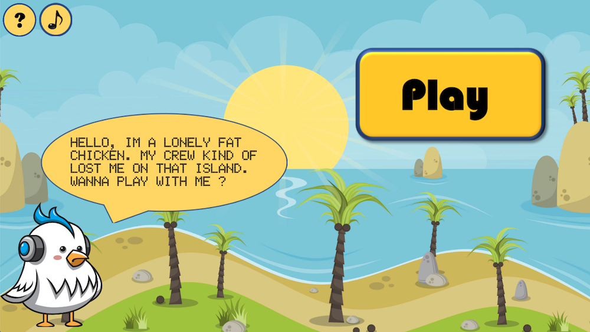
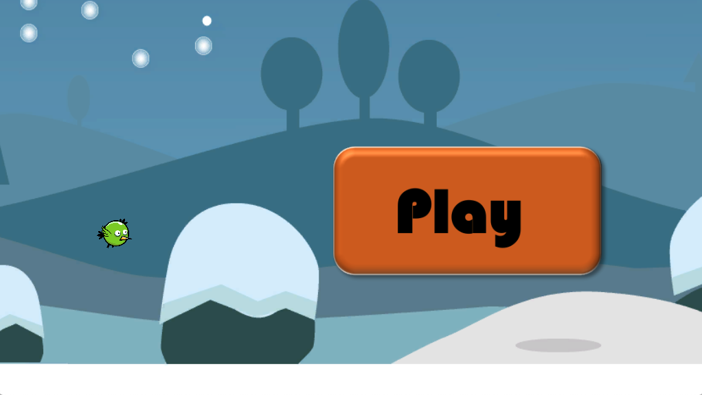

# Projets personnels d'Alexandre

Vous trouverez ici des exemples de jeu que j'ai développé principalement avec Unity.

==> [Jouer en ligne ICI.](https://alaurent4.gitlab.io/codebook) <==

Le premier Mad Birds est une application du tutorial de Jason Weimann avec une construction supplémentaire de niveau et l'apparition d'un boss de fin.

Mon deuxième jeu Sliding Rows est plus poussé. J'ai repris un ancien projet d'études écrit initialement en Python, que j'ai modifié et converti pour en faire un jeu sur Unity. Il est sans cesse en développement.

# Sliding Rows

L'équivalent du Puissance 4. Ce gentil poulet s'est perdu et s'ennuie à mourir sur son île. Vous devriez faire une partie ou deux avec lui. Vous vous affrontez en plaçant chacun votre tour un pion dans une grille. Le premier à parvenir à faire un aligmement vertical, horizontal ou diagonal de 4 pions remporte la partie. Les joueurs peuvent aussi basculer la grille vers la gauche ou la droite (slide) pour renverser les pions et ainsi changer le cours de la partie. Cliquez sur la colonne pour poser votre pion. Basculez en utilisant les boutons sur les côtés. Basculer la grille fait sauter votre tour.

# Mad Birds

Une pâle copie du chamboule-tout aviaire. Cliquez sur l'oiseau vert et glissez le vers la gauche puis relâcher pour lui donner assez d'élan et se débarrasser de ses ennemis. Arriverez-vous à dégommer tous les monstres en un seul coup. Attention leur chef n'est pas très loin de là..

